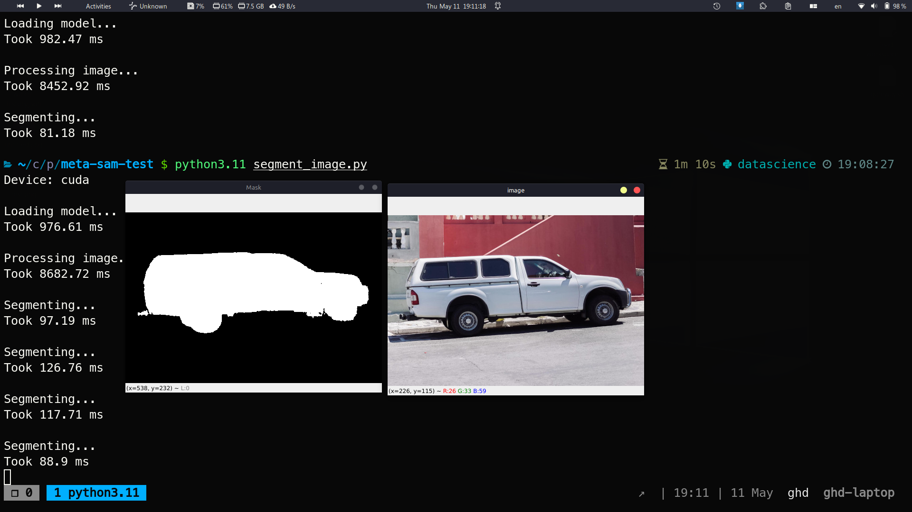

# Interactive Segmentaion ViT

This is a demo of [https://github.com/facebookresearch/segment-anything](https://github.com/facebookresearch/segment-anything) from Meta.

## Demo



<video>
    <source src="segment_demo.mp4" type="video/mp4">
</video>

## Requirements

```shell
pip install 'git+https://github.com/facebookresearch/segment-anything.git'
```

Other dependencies:

```shell
numpy
matplotlib
torch
torchvision
opencv-python
ghdtimer
```

Download the pretrained model from [here](https://dl.fbaipublicfiles.com/segment_anything/sam_vit_b_01ec64.pth) and put it in the `models` folder.

If you want to use bigger models, you can download them from [here](https://github.com/facebookresearch/segment-anything#model-checkpoints) and rename the `model_path` in `segment_image.py`. Dont forget to set the `model_type` too(vit_h, vit_b, ...).

## Run Demo

```shell
python segment_image.py
```
